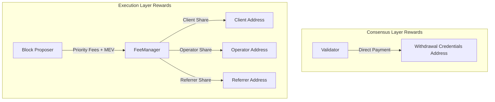

# CDAO Staking Contract

## Validator Registration Steps

### 1. User send ETH to SSVProxyFactory contract

Users need to call `addEth` function to deposit ETH to SSVProxyFactory contract.

```solidity
function addEth(
    bytes32 _eth2WithdrawalCredentials,
    uint96 _ethAmountPerValidatorInWei,
    FeeRecipient calldata _clientConfig,
    FeeRecipient calldata _referrerConfig,
    bytes calldata _extraData
)
```

Parameters:

- `_eth2WithdrawalCredentials`: The withdrawal credentials for the validator. This is a 32-byte value that determines where validator rewards/withdrawals will be sent. Must start with 0x01 followed by a 20-byte address.

- `_ethAmountPerValidatorInWei`: Amount of ETH to deposit per validator in Wei. Must be at least 32 ETH (32e18 Wei).

- `_clientConfig`: Configuration for client fee sharing:

  - `recipient`: Address to receive client's share of rewards
  - `basisPoints`: Client's share in basis points (1 basis point = 0.01%)

- `_referrerConfig`: Configuration for referrer fee sharing:

  - `recipient`: Address to receive referrer's share of rewards
  - `basisPoints`: Referrer's share in basis points

- `_extraData`: Additional data that can be passed through to hooks/events (optional)

Returns:

- `bytes32`: Unique deposit ID
- `address`: Address of deployed FeeManager instance
- `address`: Address of deployed SSVProxy instance

### 2. CDAO's operator create beacon chain deposit data and corresponding SSV shares data for each validator.

The operator needs to generate SSV shares data for each validator using SSV DKG (Distributed Key Generation) protocol:

1. Operator initiates DKG process by calling SSV network's DKG contract
2. DKG participants (SSV operators) collectively generate:
   - Validator public key
   - Individual SSV key shares
   - Signature shares
   - Deposit data for beacon chain

Key aspects of SSV DKG:

- Threshold signature scheme (t-of-n) where t operators must participate to sign
- No single operator has access to the full validator private key
- Key shares are generated in a distributed way without a trusted dealer
- Produces BLS12-381 key pairs compatible with ETH2 deposit contract
- Integrated with SSV network for automated share distribution

The generated data includes:

- Validator public key (48 bytes)
- Individual SSV key shares (encrypted for each operator)
- Withdrawal credentials
- Deposit data root
- Deposit signature

This data is then used in the next step to register validators on both the beacon chain and SSV network.

### 3. CDAO's operator submit deposit data to SSVProxyFactory contract

```solidity
    function makeBeaconDepositsAndRegisterValidators(
        bytes32 _eth2WithdrawalCredentials,
        uint96 _ethAmountPerValidatorInWei,
        address _feeManagerInstance,
        DepositData calldata _depositData,
        uint64[] calldata _operatorIds,
        bytes[] calldata _publicKeys,
        bytes[] calldata _sharesData,
        uint256 _amount,
        ISSVNetwork.Cluster calldata _cluster
    )
```

Parameters:

- `_eth2WithdrawalCredentials`: Withdrawal credentials for ETH2 validators (32 bytes)
- `_ethAmountPerValidatorInWei`: Amount of ETH per validator in Wei (must be 32 ETH)
- `_feeManagerInstance`: Address of deployed FeeManager instance
- `_depositData`: Struct containing arrays of validator signatures and deposit data roots:
  - `signatures`: Array of BLS signatures for validator deposits
  - `depositDataRoots`: Array of deposit data roots for validator deposits
- `_operatorIds`: Array of SSV operator IDs that will run the validators
- `_publicKeys`: Array of validator public keys (48 bytes each)
- `_sharesData`: Array of encrypted key shares data for each validator
- `_amount`: Amount of SSV tokens to deposit for validator operation
- `_cluster`: SSV network cluster configuration struct containing:
  - `validatorCount`: Number of validators in cluster
  - `networkFeeIndex`: Index for network fee calculation
  - `index`: Unique cluster index
  - `active`: Whether cluster is active
  - `balance`: SSV token balance

The function:

1. Makes validator deposits to ETH2 deposit contract
2. Transfers SSV tokens to SSVProxy contract
3. Registers validators with SSV network via SSVProxy

### 4. User can refund their ETH back if CDAO's operator doesn't register validators in 1 day.

```solidity
    function refund(
        bytes32 _eth2WithdrawalCredentials,
        uint96 _ethAmountPerValidatorInWei,
        address _feeManagerInstance
    )
```

Parameters:

- `_eth2WithdrawalCredentials`: Withdrawal credentials that were used for the original deposit (32 bytes)
- `_ethAmountPerValidatorInWei`: Amount of ETH per validator in Wei that was specified in the original deposit
- `_feeManagerInstance`: Address of the FeeManager instance associated with the deposit

The function allows clients to refund their ETH deposit if:

1. The deposit has expired (24 hours have passed since deposit)
2. The operator has not registered the validators
3. The caller is either:
   - The client who made the deposit
   - The operator
   - The ETH deposit operator

The full ETH amount is refunded to the client's address.

## Rewards Payment Flow



The rewards flow consists of two parts:

### Consensus Layer (CL) Rewards

CL rewards (attestation rewards) are sent directly to the withdrawal credentials address specified during validator registration. This address is controlled by the client.

### Execution Layer (EL) Rewards

EL rewards (priority fees and MEV) flow through the following path:

1. The validator's fee recipient address is set to the FeeManager for that client
2. FeeManager splits the rewards according to the configured fee percentages:
   - Client's share is sent to their configured address
   - Operator's share is sent to their configured address
   - Referrer's share (if any) is sent to their configured address

The fee splits are configured during FeeManager initialization and cannot be changed afterwards.

This dual reward structure ensures:

- Client has direct control of CL rewards via withdrawal credentials
- EL rewards are automatically split between participants
- Trustless reward distribution through smart contracts

## Prerequisites

- Node.js and npm installed
- Hardhat environment set up
- `.env` file with required environment variables:
  ```
  PRIVATE_KEY=your_private_key
  ETHERSCAN_API_KEY=your_etherscan_api_key
  GOERLI_RPC_URL=your_goerli_rpc_url
  MAINNET_RPC_URL=your_mainnet_rpc_url
  ```

## Deployment

1. Set up your environment variables in `.env`

2. Deploy contracts:

```bash
# For Kurtosis testnet
npx hardhat deploy:all --network kurtosis

# For Holesky
npx hardhat deploy:all --network holesky
```

The deployment script will:

- Deploy all necessary contracts
- Set up initial configurations
- Save deployment artifacts in `deployments/` directory

## Contract Verification

After deployment, verify your contracts on Etherscan:

```bash
# For Kurtosis testnet
npx hardhat verify:all --network kurtosis

# For Holesky
npx hardhat verify:all --network holesky
```

## Post-Deployment Setup

After deployment, you can configure:

1. Set SSV Factory:

```bash
npx hardhat setSSVFactory --network <network>
```

2. Set Operator:

```bash
npx hardhat setOperator --operator <operator_address> --network <network>
```

## Contract Addresses

After deployment, contract addresses will be saved in `deployments/` directory with timestamp and chain ID.
